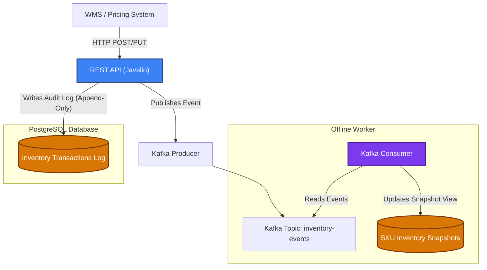

# Inventory Stock Ledger Microservice (Stock Ledger 2.0 Prototype)

A lightweight, event-driven JVM microservice simulating **Target's Stock Ledger 2.0** system. This service handles inventory valuation, inbound receipts, sales tracking, and **Warehouse Cost Adjustments (WCA)**.


Built with a **framework-free architecture** using Javalin, Apache Kafka, PostgreSQL, and Maven to demonstrate financial auditability, eventual consistency patterns, and high-throughput database design.

---

## 🚀 Local Development Setup

This repository includes a `docker-compose.yml` to spin up all dependent services locally:

```bash
# 1. Start PostgreSQL & Kafka in KRaft mode (No Zookeeper required)
docker compose up -d

# 2. Build the project and download dependencies
mvn clean package

# 3. Run the JVM Microservice locally
mvn exec:java
```

---

## System Architecture

The service follows an **Event Sourcing + CQRS-inspired pattern**. The REST API handles immediate transaction logging and publishes events to Kafka, while a background consumer asynchronously updates fast-read snapshot tables. This decoupling ensures the system remains highly available during peak warehouse operations while maintaining a perfect financial audit trail.



---

## REST API Endpoints

| Method | Endpoint | Purpose | Business Scenario |
| :--- | :--- | :--- | :--- |
| `POST` | `/api/v1/transactions/receipt` | Record inbound inventory | A warehouse truck arrives with 500 new laptops. The WMS calls this to increase asset value. |
| `PUT` | `/api/v1/inventory/{skuId}/cost-adjustment` | Handle WCA / Shrinkage | Finance realizes a supplier raised prices or an auditor found damaged goods requiring a write-off. |
| `GET` | `/api/v1/inventory/{skuId}/current-value` | Real-time valuation query | CFO dashboard needs the exact dollar value of a specific SKU across all warehouses instantly. |
| `GET` | `/api/v1/ledger/history?startDate=...` | Immutable audit trail | Validates parallel operations against the legacy mainframe for end-of-quarter financial reporting. |

---

## Database Design & Data Model (PostgreSQL)

**Why PostgreSQL?** 
Financial systems require strict **ACID compliance**, robust indexing strategies, and reliable transactional guarantees. Postgres provides excellent performance for high-throughput inserts while allowing complex analytical queries when needed.

### The Hybrid Data Model
To balance financial integrity with query performance, we use a two-table approach:

#### 1. `inventory_transactions` (The Source of Truth)
An **append-only log** that records every single movement of inventory. This guarantees an immutable audit trail essential for the "two clean quarters" parallel validation goal.

```sql
CREATE TABLE inventory_transactions (
    -- Primary Key for the transaction log
    transaction_id BIGINT GENERATED ALWAYS AS IDENTITY PRIMARY KEY,
    
    -- Timestamp is crucial for financial reporting windows
    transaction_timestamp TIMESTAMP WITH TIME ZONE NOT NULL DEFAULT now(),
    
    -- The item identifier. This is an item that Target sells or holds inventory.
    sku_id VARCHAR(50) NOT NULL,

    -- What kind of event was this? (RECEIPT, SALE, ADJUSTMENT)
    transaction_type VARCHAR(100) NOT NULL,

    -- How many units moved? (Negative for sales/write-offs, Positive for receipts)
    quantity_change INTEGER NOT NULL,

    -- The financial value per unit at the time of this specific transaction
    unit_cost DECIMAL(10, 4) NOT NULL DEFAULT 0.00,

    -- A simple calculation showing the total dollar impact of this single event
    -- Total = Quantity x Unit-Cost
    total_amount_impact DECIMAL(15, 2) GENERATED ALWAYS AS (quantity_change * unit_cost) STORED
);

-- PERFORMANCE OPTIMIZATION:
-- Index for O(log N) lookups on historical data
-- This index solves the "slow query" problem by allowing us to instantly find all the history
-- for a specific item without sacnning the whole table.
CREATE INDEX idx_transactions_sku ON inventory_transactions (sku_id);
```

#### 2. `sku_inventory_snapshots` (The Fast-Read View)
A derivative summary table updated by the Kafka consumer to provide $O(1)$ read performance without running expensive `SUM()` aggregations over millions of rows on every dashboard load.

This is a rolling calculation that is updated as events come in.

```sql
CREATE TABLE sku_inventory_snapshots (
    -- Item identifier is the Primary Key for this table.
    sku_id VARCHAR(50) PRIMARY KEY,
    current_quantity INTEGER NOT NULL DEFAULT 0,
    total_current_value DECIMAL(15, 2) NOT NULL DEFAULT 0.00,
    last_updated TIMESTAMP WITH TIME ZONE DEFAULT now()
);
```

#### 3. Accurate Nightly Snapshot Table
Over time, the `sku_inventory_snapshots` may fall out of alignment with truthfulness due to rounding errors, or calculation errors. The nighly snapshot table solves that problem by providing an accurate view of the state of inventory.

It does this by calculating from the raw `inventory_transactions` for every sku_id. Since this operation could potentially involve reading millions and millions of rows, it is performed nightly on read-only replica databases.

---

## Architectural Trade-offs & Design Decisions

### 1. State-Based vs. Append-Only (Event Sourcing)
*   **Approach A (Direct State Updates):** Simple and fast, but if a discrepancy occurs between our new system and the legacy mainframe, we have no historical context to debug it. 
*   **Approach B (Append-Only Log):** Chosen for this project. Every transaction is preserved immutably. If a bug is found 6 months later, we can replay the exact sequence of events to locate the error. The trade-off is higher storage usage and slower aggregate queries, which we mitigate using the `sku_inventory_snapshots` table.

### 2. Synchronous vs. Asynchronous Updates (Eventual Consistency)
Instead of updating the snapshot table inside the same database transaction as the REST API call, we publish an event to **Kafka**. 
*   **Trade-off:** This introduces a microsecond-level window of *eventual consistency*. A user querying the current value immediately after posting a receipt might see stale data for a few hundred milliseconds.
*   **Why it wins here:** It prevents database locking bottlenecks during high-volume warehouse shifts and allows us to scale the Kafka consumers independently from the API servers without risking system downtime.

### 3. Framework-Free JVM (Javalin vs. Spring Boot)
By using Javalin, we strip away heavy framework boilerplate. This reduces memory footprint, simplifies troubleshooting production issues (no hidden magic in dependency injection), and provides complete stacktrace visibility when errors happen.